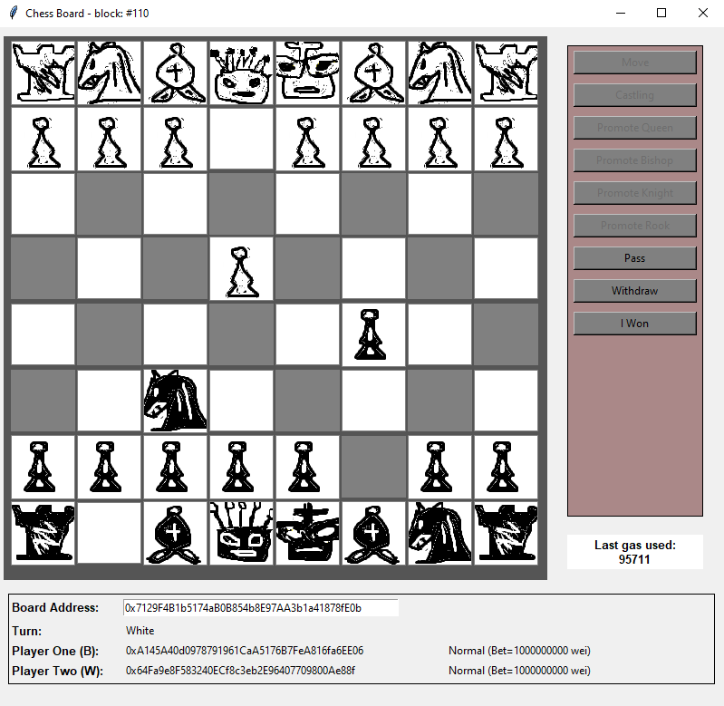
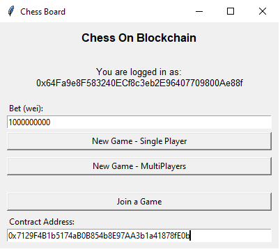

# Challenge - Chess on blockchain

This project is about implementation of chess as smart contract on ethereum blockchains. 
- The smart contract will define game rules and validation on moves
- Data of pieces such as location on board and promotion status resides on blockchain.
- Player interacts the smart contract to "move" the pieces on the "board"
- Winner will be rewarded the bet from loser

This challenge is attempting to overcome to limitations on smart contract, (in programming language Solidity). For instant, player will pay the gas when moving pieces on board, speed of the transaction, code size is limited (24KB), etc. To reduce those negative impacts, Smart Contract should be implemented so that:
- Minimize gas 
- Make fair interactions (gas paid by both players should be nearly same amount regardless of which pieces to be moved)
- Correctness, Security, Code simplicity

The lastest stats (check how to perform the stats at [tests\performance.py](tests/performance.py)):

|Movement  |Gas Used (Black)|Gas Used (White)|
|---------|---------|---------|
|Pawn     |97732         |98699         |
|Pawn (2 steps)    |99645         |100620         |
|Knight     |82119         |83045         |
|Rook     |82486         |83412         |
|Bishop     |85530         |86452         |
|Queen     |84026         |84948         |
|King     |69962         |100895         |

|Operation  |Gas Used |
|---------|---------|
|Deploy     |3681065         |


## About the game

Game Rules:
- Anyone can create board (smart contract) which allows two players
- Anyone can join the board with no/one player. Later player joins as Player Two
- Player One sends certain amount of ETH as bet and defines minimun entry fee (cannot greater than his/her sent bet)
- Player Two joins the game with bet amount >= minimun entry fee
- Players can withdraw the game (loss) and the winner can then collect the bet
- Player can pass the game. If both agree, both can collected back his/her claimed bet. (Gas paid cannot be refund)

Smart Contract should have functions:
- Join game
- Move Pieces (with castling and promotion as normal chess)
- Pass and Withdraw the game
- Collect the bet if win

## Development
Here used Brownie and Python for development, testing, contract deployment and client application. 
This repo includes a GUI in TKinter as a tool to simulate smart contract client (player).

Below are screenshots for the application:





To compile the smart contract:

`brownie compile`

To deploy the contract:

`brownie run scripts\deploy.py`

To run the client application:

`brownie run scripts\client.py`

To run the performance script:

`brownie run scripts\stats.py`

To test the cases in folder .\tests\:

`brownie test`


### Limitations
This project is not for putting on production blockchain (No one will pay for such game with real money!), but the design is open to extend to that. It takes configuration files .env and brownie-config.yaml for various tunning transaction on blockchain.

## APIs

Public functions defined in smart contract:
```solidity
function ctx()
function GetPiecesInfo() returns (string memory)
function JoinGame(uint256 minEntryFee) payable
function MovePiece(PieceID pid, uint8 pos_r, uint8 pos_c, uint256 speccmd)
function Win() payable
```

### ctx()
```solidity
function ctx()
```
The context of the board on the blockchain. It returns structure:
```solidity
enum PlayerState {
    Normal,
    Withdraw,
    Pass
}

struct Player {
    address player_address;
    PlayerState state;
    uint256 bet;
}

struct Context {  
    Player PlayerOne;
    Player PlayerTwo;
    uint256 fee;
    int playerturn;
}
```

- **PlayerOne**: the player one (black) with address, state and the bet in wei. State can be set to withdraw if King is captured. If the state is Withdraw, it means Player Two win.
- **PlayerTwo**: the player one (White) with address, state and the bet in wei. State can be set to withdraw if King is captured. If the state is Withdraw, it means Player One win.
- **fee**: the entry fee to join the game.
- **playerturn**: number of turns of the game. Start with 0 (Black)

### GetPiecesInfo()

```solidity
function GetPiecesInfo() returns (string memory)
```

Information of the board in string format:
```
[(Piece ID, Piece Type, row, column, alive), ...]
```
The lenght of the array is 32 (i.e. 32 pieces).

- **Piece ID**: 0-indexed integer to represent the id of each piece.
```solidity
enum PieceID {
    p1_king, p1_queen, p1_rookl, p1_rookr, p1_bishopl, p1_bishopr, p1_knightl, p1_knightr, p1_pawn1, p1_pawn2, p1_pawn3, p1_pawn4, p1_pawn5, p1_pawn6, p1_pawn7, p1_pawn8,
    p2_king, p2_queen, p2_rookl, p2_rookr, p2_bishopl, p2_bishopr, p2_knightl, p2_knightr, p2_pawn1, p2_pawn2, p2_pawn3, p2_pawn4, p2_pawn5, p2_pawn6, p2_pawn7, p2_pawn8
}
```
- **Piece Type**: 0-indexed integer to represnet the type of the piece. It can change if pawn is promoted.
```solidity
enum PieceType{
    king, rook, bishop, queen, knight, pawn
}
```
- **row**: row on the block, which is 0-indexed (i.e. in range of \[0,7\])
- **column**: column on the block, which is 0-indexed (i.e. in range of \[0,7\])
- **alive**: 0 or 1 indicator on whether the piece is captured


### JoinGame()

```solidity
function JoinGame(uint256 minEntryFee) payable
```

Called by client to join the game. It is **Not** the bet which should be set as transaction value when calling this method.

- **minEntryFee**: The amount in wel to define the minimun entry fee of the game. Valid to player one only.


### MovePiece()

```solidity
function MovePiece(PieceID pid, uint8 pos_r, uint8 pos_c, uint256 speccmd)
```

Commands send from player to associate with the board.

- **pid**: Piece ID defined in the board (smart contract).
- **pos_r**: row of the target position to move, which is 0-indexed (i.e. in range of \[0,7\])
- **pos_c**: column of the target position to move, which is 0-indexed (i.e. in range of \[0,7\])
- **speccmd**: 0-indexed integer for commands such as caslting, pawn promotion. Also include game operations such as Pass and Withdraw.

```solidity
enum SpecCommand {
    Null, Withdraw, Pass, Castle, PromoteToQueen, PromoteToRook, PromoteToBishop, PromoteToKnight
}
```

**Note**: 
- If player issues Withdraw, the game will be completed.
- If player A issues Pass, player B can either pass or issues different command to stating no agree to tie the game.
- If player issues Castle, the pid should refer to the rook, not the king.

### Win()

```solidity
function Win() payable
```

Winner collects the bet from players (player 1's bet plus Player 2's bet) after winning the game. The balance of the smart contract will add to winner's balance and the contract is no longer playable.


## License

[GPL v2](LICENSE)
